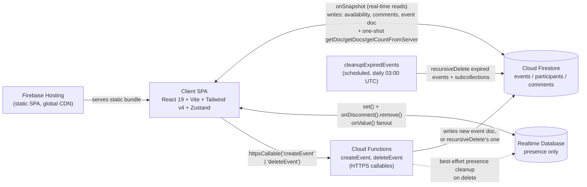
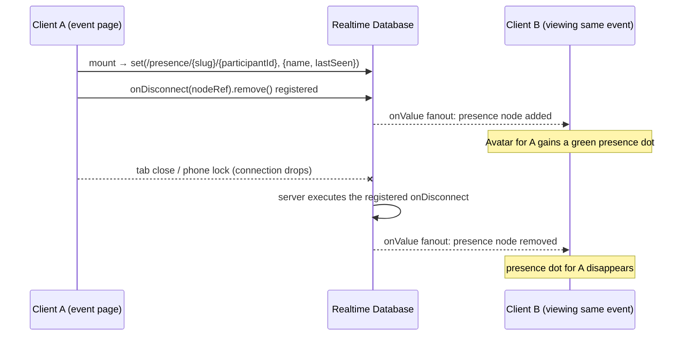

# Architecture

schedule2gather is a client-heavy, serverless scheduling app: a React SPA talking directly to
Firestore (data), the Realtime Database (ephemeral presence), and three small Cloud Functions
(`createEvent`, `deleteEvent`, `cleanupExpiredEvents`). There is no application server — all
product logic (ranking, export generation, painting, undo) runs in the browser.

This document reflects the codebase as of the 2026-07 redesign
(`docs/superpowers/specs/2026-07-18-redesign-design.md`), the v1.1 follow-up
(`docs/superpowers/specs/2026-07-18-v1.1-followup-design.md`), the v1.2 mobile UX pass
(`docs/superpowers/specs/2026-07-19-v1.2-mobile-ux-design.md`), and the v1.3 landing/dashboard
redesign (`docs/superpowers/specs/2026-07-19-v1.3-landing-dashboard-design.md`): range date
selection, the group-first stacked layout, host finalize/reopen, idle-event GC, mobile grid/create
polish, and — new in v1.3 — the landing page's join-by-code flow, a dedicated `/new` create route,
an owner dashboard (`/dashboard`), and the `deleteEvent` callable.

## System Context



- **Client SPA** — React 19 + TypeScript + Vite 7, styled with Tailwind v4 tokens, state held in
  four Zustand stores (`authStore`, `eventStore`, `paintStore`, `themeStore`). No SSR; deployed as
  a static bundle.
- **Firebase Hosting** — serves the built SPA from a global CDN; SPA rewrite (`**` → `/index.html`);
  long-cache immutable headers on `/assets/**`, no-cache on `/index.html` (`firebase.json`).
- **Firestore** — the system of record: `events/{slug}`, `events/{slug}/participants/{id}`,
  `events/{slug}/comments/{id}`. Most reads are live `onSnapshot` subscriptions; the v1.3 join-by-code
  check and dashboard (`getEvent`, `listMyEvents`, `countParticipants`) are the exceptions — one-shot
  reads, since neither needs live updates.
- **Realtime Database** — used for exactly one thing: presence. Chosen specifically for its native
  `onDisconnect` semantics (see "Presence sequence" below).
- **Cloud Functions** — `createEvent` (HTTPS callable, validates input and mints the event doc),
  `deleteEvent` (HTTPS callable, v1.3: owner-checked recursive delete, see "Delete event" below), and
  `cleanupExpiredEvents` (scheduled, deletes events past their 90-day `expiresAt`, **or** idle
  events whose dates have all passed — v1.1, see "Garbage collection" below). All three are
  request/response or cron-triggered; none sits in a real-time path.

## Data Model

### `events/{slug}` — `EventDoc` (`src/services/eventService.ts`)

| Field | Type | Notes |
|---|---|---|
| `name` | `string` | Trimmed, ≤80 chars (enforced in `functions/src/lib/validate.ts`) |
| `createdAt` | `Timestamp` | Set by `createEvent` |
| `expiresAt` | `Timestamp` | `createdAt` + 90 days; read by `cleanupExpiredEvents` |
| `ownerUid` | `string` | Firebase Auth UID (anonymous or Google-linked) of the creator |
| `ownerEmail` | `string?` | Written by `setOwnerEmail` when the host links Google |
| `mode` | `'specific_dates' \| 'weekdays_in_range' \| 'weekdays_recurring'` | Only `specific_dates` is reachable from the current create-flow UI; the other two remain server-validated and schema-supported (see BACKLOG.md) |
| `dates` | `string[]` | ISO `yyyy-MM-dd` dates, or weekday tokens (`mon`…`sun`) for recurring mode |
| `timeRange` | `{ start: number; end: number }` | Hours, 0–24, per-day bounds |
| `slotMinutes` | `15 \| 30 \| 60` | Grid resolution |
| `timezone` | `string` | Event's canonical IANA timezone; the bitmap is indexed in this zone |
| `slotCount` | `number` | `dates.length × slotsPerDay`; precomputed server-side, reused client-side (`bestSlots.ts`) |
| `finalized` | `{ startSlot: number; endSlot: number; finalizedAt: Timestamp } \| null` | v1.1: set by `finalizeEvent`, cleared (`null`) by `reopenEvent`. Absent on events created before v1.1 — treated as open (see `eventOpen()` below) |
| `lastVisitedAt` | `Timestamp?` | v1.1: best-effort visit marker written by `touchLastVisited`, client-throttled to once per 24h; read by `cleanupExpiredEvents`' idle-GC predicate |

### `events/{slug}/participants/{participantId}` — `ParticipantDoc` (`src/services/participantService.ts`)

| Field | Type | Notes |
|---|---|---|
| `participantId` | `string` | Client-generated `nanoid()`, stable per (device, normalized name) via `localStorage` (`src/lib/participantId.ts`) |
| `name` | `string` | Trimmed display name, original casing preserved |
| `uid` | `string` | Firebase Auth UID (anonymous) that last wrote this doc |
| `availability` | `string` | Base64 packed bitmap, MSB-first (`src/lib/bitmap.ts`); one bit per slot, index = `dateIdx * slotsPerDay + timeIdx` |
| `lastUpdated` | `Timestamp` | Server timestamp on every write |

### `events/{slug}/comments/{commentId}` — `CommentDoc` (`src/services/commentService.ts`)

| Field | Type | Notes |
|---|---|---|
| `id` | `string` | Firestore doc ID (client-attached on read, not stored) |
| `text` | `string` | 1–500 chars |
| `authorName` | `string` | 1–80 chars |
| `uid` | `string` | Author's Auth UID (own-only update/delete) |
| `participantId` | `string` | Links the comment to a participant row |
| `createdAt` | `Timestamp \| null` | `serverTimestamp()`; queried newest-first (`orderBy('createdAt', 'desc')`) |

### Realtime Database — `/presence/{eventId}/{participantId}`

```json
{ "name": "string", "lastSeen": "<RTDB serverTimestamp>" }
```

Ephemeral and server-cleaned: the node is written on event-page mount (`registerPresence` in
`src/services/presenceService.ts`) and removed automatically by the RTDB server via a registered
`onDisconnect().remove()` — no TTL, no scheduled cleanup job, no client polling required. This tree
is entirely separate from Firestore and carries no other event data.

## Presence sequence



`subscribeToPresence` (`src/services/presenceService.ts`) subscribes to `presence/{slug}` as a
whole and reduces the snapshot to a `Set<participantId>`; `EventPage` passes that set into each
`Avatar`'s `present` prop.

**Degradation:** `getRtdb()` lazily calls `getDatabase(app)` inside a `try/catch`. If
`VITE_FIREBASE_DATABASE_URL` is unset (or RTDB isn't provisioned), the call throws once, `db` is
cached as `null`, and both `registerPresence` and `subscribeToPresence` become no-ops (the former
returns a no-op cleanup function; the latter never calls back with any IDs). The UI simply never
shows presence dots — no error, no retry loop, no user-visible failure.

## Security Model

### Firestore (`firestore.rules`)

- **`events/{eventId}`** — public read (`allow read: if true`); `create` is always denied at the
  rules layer (events can only be created through the `createEvent` callable, which uses the Admin
  SDK and bypasses rules); `delete` requires `request.auth.uid == resource.data.ownerUid`.
  **`update` (v1.1)** is a two-way `||`:
  - the host (`request.auth.uid == resource.data.ownerUid`) may update **any** field — this is how
    `finalizeEvent`/`reopenEvent` (writing `finalized`) and `setOwnerEmail` (writing `ownerEmail`)
    both work, unchanged from the host's pre-existing full-update right; **or**
  - **any signed-in user** (including anonymous) may update the doc if the write's
    `diff(resource.data).affectedKeys()` is *exactly* `['lastVisitedAt']` — i.e. a single-field
    visit-timestamp bump, and nothing else, from anyone who has the link.
- **`events/{eventId}/participants/{participantId}`** — public read; `create` requires
  `request.auth != null`, the event's `eventOpen()` gate (below), `uid` on the new doc matching the
  caller's UID, and `name` a non-empty string ≤80 chars; `update` requires the caller's UID to
  match the doc's `uid` **and** `eventOpen()`; `delete` only requires the UID match (no
  `eventOpen()` gate — a participant may still remove their own row after finalization).
  **`eventOpen()`** (v1.1, defined inline in the rules) is true — painting/joining allowed — when
  the event doc has no `finalized` field at all, or `finalized == null`; false while a finalized
  window is set. This is the server-side enforcement behind the finalize lock: a paint write racing
  a finalize is rejected here regardless of what the client's optimistic UI assumed.
- **`events/{eventId}/comments/{commentId}`** — public read; `create` requires an authenticated
  caller whose UID matches the new doc's `uid`, plus length bounds on `text` (1–500) and
  `authorName` (1–80); `update` is always denied (comments are immutable once posted); `delete` is
  allowed by the comment's own author **or** the event's `ownerUid` (host moderation). Comment
  creation is **not** gated by `eventOpen()` — commenting stays open after finalization (the UI
  restricts new commenters to prior participants; see `docs/ux-flows.md`).

### Realtime Database (`database.rules.json`, in full)

```json
{
  "rules": {
    ".read": false,
    ".write": false,
    "presence": {
      "$eventId": {
        ".read": true,
        "$participantId": {
          ".write": true,
          ".validate": "newData.hasChildren(['name', 'lastSeen']) && newData.child('name').isString() && newData.child('name').val().length <= 80"
        }
      }
    }
  }
}
```

Everything outside `/presence` is deny-by-default. Inside it, any client can read a whole event's
presence tree, and any client can write to any `$participantId` node — there is no per-node auth
check. `.validate` doesn't run on deletes, which is required for `onDisconnect().remove()` to work.

### Trust model

Both Firestore participant/comment writes and RTDB presence writes rely on the same assumption:
**participant IDs are unguessable, client-generated UUIDs** (`nanoid()`, 21 chars of random
alphabet, generated in `src/lib/participantId.ts` and cached in `localStorage` per
`(slug, normalized name)`). Nothing server-side maps a human identity to a participant ID beyond
"whoever holds the ID can act as that participant" — the same anonymous-auth-plus-random-ID pattern
Firestore rules already use for the participant subcollection is extended verbatim to RTDB. This is
intentionally low-friction (no login) and matches the product's "share a link, paint your name"
model; it is not intended to resist a targeted attacker who obtains another participant's ID.

## Client Architecture

| File | Responsibility |
|---|---|
| `src/stores/authStore.ts` | Firebase Auth lifecycle: silent anonymous sign-in on load, Google upgrade (`linkWithPopup`, falling back to `signInWithPopup` on `credential-already-in-use`), sign-out |
| `src/stores/eventStore.ts` | Live event + participants subscriptions (`onSnapshot`), `joinAs`/`updateMyAvailability` actions, holds `myParticipant` |
| `src/stores/paintStore.ts` | Ephemeral drag-paint interaction state — `origin`, `visited` set, `draftBits`, on/off `mode`, and the mobile `paintMode` toggle |
| `src/stores/themeStore.ts` | Theme preference (`light`/`dark`/`system`), `localStorage` persistence, stamps `data-theme` on `<html>` |
| `src/services/eventService.ts` | `createEvent`/`deleteEvent` (v1.3) callable wrappers, `subscribeToEvent`, `getEvent` (v1.3, one-shot), `listMyEvents` (v1.3), `countParticipants` (v1.3), `setOwnerEmail`, `finalizeEvent`, `reopenEvent`, `touchLastVisited` |
| `src/services/participantService.ts` | `subscribeToParticipants`, `getOrCreateParticipant`, `updateAvailability` |
| `src/services/commentService.ts` | `subscribeToComments`, `addComment`, `deleteComment` |
| `src/services/presenceService.ts` | RTDB presence register/subscribe, with silent no-op fallback when RTDB isn't configured |
| `src/services/firebase.ts` | Firebase app/auth/Firestore singleton initialization; reads all `VITE_FIREBASE_*` env vars including `databaseURL` |
| `src/lib/bitmap.ts` | Boolean-array ↔ base64 bitmap packing (`pack`/`unpack`/`getBit`/`setBit`/`setRectangle`) |
| `src/lib/slots.ts` | Slot count/index math (`slotsPerDay`, `slotIndex`, `slotsPerEvent`) |
| `src/lib/timezoneSlots.ts` | Slot index ↔ UTC `Date` conversion (DST-aware, via `date-fns-tz`) and viewer-timezone label formatting |
| `src/lib/calendarPages.ts` | Week/month pagination for the mobile grid (Sunday-anchored weeks, greyed out-of-range columns) |
| `src/lib/timezones.ts` | Curated IANA timezone list, browser auto-detect, display-label formatting |
| `src/lib/participantId.ts` | `localStorage`-backed name → `nanoid()` UUID mapping (auto-rejoin) |
| `src/lib/nameNormalize.ts` | Name normalization (lowercase/trim/collapse whitespace) used as the `localStorage` key |
| `src/lib/avatarColor.ts` | Deterministic name → warm hue + initials for `Avatar` |
| `src/lib/bestSlots.ts` | Pure best-window ranking algorithm (see below) |
| `src/lib/ics.ts` | Pure `.ics` / Google Calendar URL / summary-text generation, plus a DOM-only `downloadIcs` blob helper |
| `src/lib/heatColor.ts` | Attendance count → heatmap CSS variable (`heatColor`) / painted-cell color (`mineColor`) |
| `src/lib/dateRange.ts` | v1.1: pure `mergeRangeIntoDates(existing, from, to, today)` — merges a `DayPicker` `range` selection into the create flow's `selectedDates`, excluding past days and deduplicating by calendar day |
| `src/lib/joinCode.ts` | v1.3: pure `normalizeCode(raw)` — trims/lowercases, extracts the slug from a pasted `/e/:slug` share URL via regex, strips characters outside `[a-z0-9-]`; used by `LandingPage`'s join-by-code card |
| `src/components/GroupHeatmap.tsx` | v1.1: read-only group-overlap card — transposed per-date horizontal strips (`heatColor`-driven), hover/tap tooltip centered above the cell |
| `src/components/FinalizeSheet.tsx` | v1.1: host-only `BottomSheet` — top-3 `bestWindows` as radio choices plus a bounded custom date/time/duration picker; calls `finalizeEvent` |
| `src/components/FinalizedBanner.tsx` | v1.1: replaces `BestTimesPanel` once `event.finalized` is set — final window in viewer TZ, live attendance count, `ExportSheet` trigger, host-only `reopenEvent` button |
| `src/components/AppHeader.tsx` | v1.3: shared header for all four pages — `Wordmark`, a **Dashboard** link when `user && !user.isAnonymous`, a **Sign in** ghost button (calls `signInWithGoogle`) otherwise, and `ThemeToggle`; accepts a `className` width override (`max-w-2xl` landing/create, `max-w-5xl` default for dashboard/event) |
| `src/pages/LandingPage.tsx` | v1.3: rewritten — hero heading/subline, Create CTA → `/new`, join-by-code `Card` (`normalizeCode` + one-shot `getEvent` lookup) |
| `src/pages/CreatePage.tsx` | v1.3: thin wrapper — `AppHeader` + heading + the unchanged `CreateEventForm`, now living at `/new` |
| `src/pages/DashboardPage.tsx` | v1.3: Google-sign-in-gated event list — `listMyEvents`, per-row `countParticipants`, copy-link, inline Reopen, "Finalize…" deep-link, Delete (confirmation `BottomSheet` → `deleteEventRemote`) |

**Removed in the v1.1 follow-up:** `src/hooks/useMinWidth.ts` (the `≥1024px` media-query hook that
drove the old side-by-side dual-grid layout) was deleted once `AvailabilityGrid` dropped that
layout — no remaining consumers.

## Best-times & export are client-side

Both new features are pure functions over data the client already has from its live
`participants` subscription — no new backend endpoint was needed.

**Ranking (`src/lib/bestSlots.ts`, `bestWindows`)**: for each participant's unpacked bitmap, tally
per-slot attendance counts. Starting from the maximum observed count and working downward, find
every maximal run of *same-day*, consecutive slots whose count is `≥ level` (day boundaries are
never crossed — `bestSlots.test.ts` asserts this explicitly). Each run becomes a candidate window
`{ startSlot, endSlot, attendance, total }`. Candidates are sorted by `(attendance desc, duration
desc, earlier start)`, then greedily accepted into the result — skipping any candidate that
overlaps an already-chosen window — up to a limit of 3. Empty input or an all-zero grid returns
`[]`, driving `BestTimesPanel`'s "share the link" empty state.

**Export (`src/lib/ics.ts`)**: `windowUtcRange` converts a slot window to a UTC `{ start, end }`
pair via `slotMomentInUTC` (which itself calls `date-fns-tz`'s `fromZonedTime` against the event's
IANA timezone — DST-correct without any manual offset math). From that range:
- `buildIcs` emits an RFC 5545 `VCALENDAR`/`VEVENT` with **CRLF** line endings (not `\n`), one
  `UID` per exported window, and `escapeIcsText`-escaped `SUMMARY`/`DESCRIPTION` fields (backslash,
  semicolon, comma, newline per the spec's escaping rules).
- `googleCalendarUrl` builds a `calendar.google.com/calendar/render?action=TEMPLATE&...` URL with
  the same UTC range.
- `summaryText` renders a human copy string in the *viewer's* timezone (not the event's), including
  the `(attendance/total available)` count and the share link.
- `downloadIcs` is the one DOM-touching, untested function: it creates an object URL for a `Blob`
  and clicks a synthetic `<a download>`.

The original spec (`PRODUCTION.md` §8, §12 Phase 4) proposed a `generateIcs` Cloud Function for
`.ics` generation. That was **dropped as unnecessary**: `.ics` generation needs no secrets, no
server-side state, and no privileged computation — it is pure date/string formatting the client
already has all the inputs for — so shipping it as a client library avoids a network round-trip,
a cold-start, and a function to maintain for zero benefit.

## Garbage collection (v1.1)

`cleanupExpiredEvents` no longer runs a targeted `expiresAt`-only query. It now does a **full
collection scan** of `events` daily at 03:00 UTC, evaluates the pure predicate
`shouldDeleteEvent(event, nowMs)` (`functions/src/lib/gc.ts`) against every doc in-process (inside
the scheduled function, not a Firestore query filter), and `recursiveDelete`s whatever matches —
same deletion mechanics as before, broader selection logic. No new Firestore index is needed since
the scan itself is unchanged (a `collection('events').get()` with no `where`).

`shouldDeleteEvent` returns `true` when either is true:

1. **Hard cap (unchanged):** `expiresAt <= now` (`createdAt` + 90 days).
2. **Idle + fully past (new):** the event has calendar dates (`mode !== 'weekdays_recurring'`
   — recurring events have no calendar dates to check and fall back to the hard cap only), the
   *last* of those dates has fully ended — `Date.parse(`${lastDate}T23:59:59.999Z`) < now`, a
   deliberate **UTC end-of-day simplification** rather than the event's own timezone wall-clock —
   **and** `(lastVisitedAt ?? createdAt)` is more than **30 days** (`IDLE_MS`) before `now`.

So a finished event that nobody has revisited is now reclaimed well before its 90-day cap; an
event still being visited (`lastVisitedAt` refreshed by `touchLastVisited` on each page load, at
most once per 24h) is never idle-deleted regardless of how far in the past its dates are, only the
hard cap can remove it. `weekdays_recurring` events are exempt from the idle rule entirely — they
have no fixed calendar dates to judge "fully passed."

## Dashboard reads (v1.3)

`listMyEvents(uid)` (`src/services/eventService.ts`) is a one-shot `getDocs` query —
`where('ownerUid', '==', uid)` against the `events` collection — sorted **client-side** by
`createdAt` descending. A single-field equality filter needs no composite index (Firestore
auto-indexes every field for single-field equality/inequality queries), which is exactly why the
sort happens in JavaScript after the fetch rather than via a matching `orderBy('createdAt', 'desc')`
in the query: adding that `orderBy` alongside the `where` on a different field would require a
composite index, and the v1.3 spec explicitly ruled composite indexes out of scope.

Per-row counts come from `countParticipants(slug)`, called once per event **after** the list has
already rendered (so the row list appears before the counts do — see `DashboardPage`'s effect,
which fires one `countParticipants` promise per event right after `listMyEvents` resolves). Both
figures are server-side aggregate queries — `getCountFromServer(participantsCollection)` for
"joined", and a second `getCountFromServer(query(participantsCollection, where('availability', '!=',
'')))` for "painted" (voted) — so no participant documents are downloaded to compute either count.
The inequality filter backing "painted" can reject without a supporting index; that rejection is
caught and only hides the painted figure for that one row (`painted: null`), it does not fail the
row or the page.

## Delete event (v1.3)

`deleteEvent` (`functions/src/deleteEvent.ts`, exported from `functions/src/index.ts`) is the only
backend addition in v1.3, and the only path through which an event's data is actually removed by a
user action — there was no client-side delete before it. That matters because Firestore's client
SDK cannot cascade-delete subcollections: a plain rules-gated `deleteDoc` on `events/{eventId}`
would remove the event doc but orphan its `participants` and `comments` subcollections.

- **Input validation:** `req.data.slug` must match `/^[a-z0-9-]{1,40}$/` or the function throws
  `invalid-argument` before touching Firestore.
- **Ownership check:** the pure helper `assertDeletable(data, uid)`
  (`functions/src/lib/deleteGuard.ts`, unit-tested in
  `functions/src/__tests__/deleteGuard.test.ts`) takes the fetched event doc (or `undefined` if it
  doesn't exist) and the caller's uid, returning one of
  `'ok' | 'unauthenticated' | 'not-found' | 'permission-denied'` — no `req.auth` → `unauthenticated`,
  no doc → `not-found`, `ownerUid` mismatch → `permission-denied`. The callable maps every
  non-`'ok'` verdict to the matching typed `HttpsError` code.
- **Deletion:** `db.recursiveDelete(ref)` (Admin SDK) removes the event doc and every document in
  its `participants` and `comments` subcollections in one call — the same mechanism
  `cleanupExpiredEvents` already uses for GC.
- **Presence cleanup:** a best-effort `getDatabase().ref('presence/' + slug).remove()` wrapped in
  `try/catch` — the RTDB instance may not be provisioned in every environment (see "Degradation"
  under "Presence sequence" above), so a failure here is swallowed rather than failing the whole
  delete.
- Returns `{ ok: true }` on success.

Because the Admin SDK bypasses Firestore rules entirely, `deleteEvent` doesn't rely on the existing
`allow delete: if request.auth.uid == resource.data.ownerUid` rule on `events/{eventId}` — that rule
is unchanged by v1.3 and still nominally permits a direct client delete of the top-level doc, but
the UI now always goes through the callable so subcollections are never orphaned. **No Firestore or
RTDB rules changes shipped with v1.3** — read/list/`getCountFromServer` were already public, and
delete is now mediated entirely by the callable.

**Client:** `deleteEventRemote(slug)` (`src/services/eventService.ts`) wraps
`httpsCallable(functions, 'deleteEvent')`, reusing the same lazily-initialized `Functions` singleton
`createEvent` already uses (`getFunctionsClient()`). `DashboardPage`'s delete action is gated behind
a confirmation `BottomSheet` before it's called.

## CI/CD

Two GitHub Actions workflows (`.github/workflows/`), both `actions/setup-node@v4` on Node 20:

**`firebase-hosting-pull-request.yml`** (on `pull_request`, same-repo only — forks are skipped via
an `if` guard on `head.repo.full_name`):
1. `npm ci`
2. `npm run lint`
3. `npm run typecheck`
4. `npm test` (Vitest)
5. `npm run build` (with all `VITE_FIREBASE_*` secrets injected, including `VITE_FIREBASE_DATABASE_URL`)
6. `FirebaseExtended/action-hosting-deploy@v0` — no `channelId` given, so it deploys to an
   auto-named PR preview channel and comments the preview URL on the PR.

**`firebase-hosting-merge.yml`** (on push to `main`):
1. `npm ci` → lint → typecheck → `npm test` (root)
2. `functions/`: `npm ci` → `npm test` → `npm run build`
3. `npm run build` (root, same `VITE_FIREBASE_*` secrets)
4. `FirebaseExtended/action-hosting-deploy@v0` with `channelId: live` → production Hosting
5. `firebase-tools@latest deploy --only functions` (all three: `createEvent`, `deleteEvent` — v1.3
   — and `cleanupExpiredEvents`)
6. **(v1.1)** `firebase-tools@latest deploy --only firestore:rules` — deploys `firestore.rules` on
   every merge, so the `eventOpen()`/`finalized` rule changes (and any future rules edit) ship
   automatically instead of requiring a manual deploy. A separate, `continue-on-error: true` step
   then runs `firebase-tools@latest deploy --only database` for `database.rules.json` — marked
   best-effort per the workflow's own comment ("Best-effort until the Realtime Database instance is
   provisioned"), since the RTDB instance isn't provisioned in every environment (see "Degradation"
   under "Presence sequence" above); once it exists, this step starts deploying its rules for real
   without any workflow change.
7. A follow-up `gcloud run services add-iam-policy-binding` step idempotently re-grants
   `allUsers: run.invoker` on **both** the `createevent` and `deleteevent` Cloud Run services (v1.3
   added the second binding alongside the new callable) — gen-2 callables can silently lose the
   public-invoker binding on redeploy via service account, so this step guards against either
   function becoming unreachable after a deploy.

**Secrets used by both workflows:** `VITE_FIREBASE_API_KEY`, `VITE_FIREBASE_AUTH_DOMAIN`,
`VITE_FIREBASE_PROJECT_ID`, `VITE_FIREBASE_DATABASE_URL`, `VITE_FIREBASE_STORAGE_BUCKET`,
`VITE_FIREBASE_MESSAGING_SENDER_ID`, `VITE_FIREBASE_APP_ID`, `VITE_FIREBASE_MEASUREMENT_ID`, plus
`FIREBASE_SERVICE_ACCOUNT_SCHEDULE2GATHER` and the built-in `GITHUB_TOKEN` (merge workflow only,
for the Functions/Cloud Run steps). `VITE_FIREBASE_DATABASE_URL` is the one secret added for this
redesign; without it in CI, preview and production builds still succeed — presence just degrades
silently per the fallback above.

`firebase.json` deploys three targets from one project: `hosting` (SPA), `firestore` (rules +
indexes), `database` (RTDB rules), plus `functions`. `npm run deploy` locally runs
`firebase deploy --only hosting,firestore:rules,database,functions`.

## Why plain Firebase (no Cloud Run / GCP)

Nothing shipped in this release needs custom infrastructure:

- **Presence** is the one feature that looks like it might need a stateful server (tracking who's
  "online"). Realtime Database's native `onDisconnect` handles that natively — no heartbeat
  polling, no TTL sweep job, no WebSocket server to run ourselves.
- **Best-times ranking and calendar export** are pure functions over data already streamed to the
  client via `onSnapshot`; there's no privileged computation or secret involved, so running them in
  the browser is strictly cheaper and simpler than a Cloud Function round-trip.
- **Event creation** is the one place that genuinely needs a trusted server step (slug uniqueness
  check + write), and that's already a small `onCall` Cloud Function — no change needed here.
- **Event deletion** (v1.3) similarly needs a trusted server step — an owner check plus a
  cascading delete of subcollections the client SDK can't perform on its own — so it's a second
  small `onCall` Cloud Function (`deleteEvent`) rather than a client-side rules change.

This mirrors the reasoning already on record in `PRODUCTION.md` §3: plain Firebase stays sufficient
until either (a) **two-way calendar sync** is added — webhook delivery, OAuth token refresh, and
rate-limit handling for Google/Outlook would want a Cloud Run service with a job queue
(Pub/Sub + worker), or (b) **ML-based scheduling suggestions** are added — that would want Vertex AI
or a Cloud Run inference endpoint. Neither is in scope for this release; both remain the two
concrete triggers for revisiting this decision.
