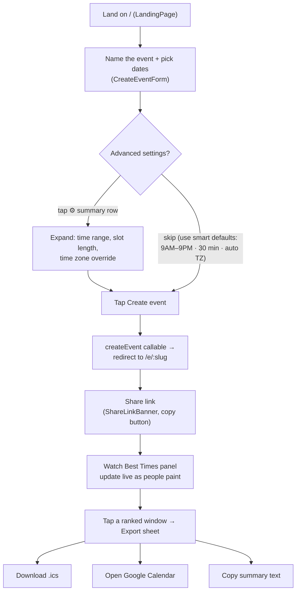
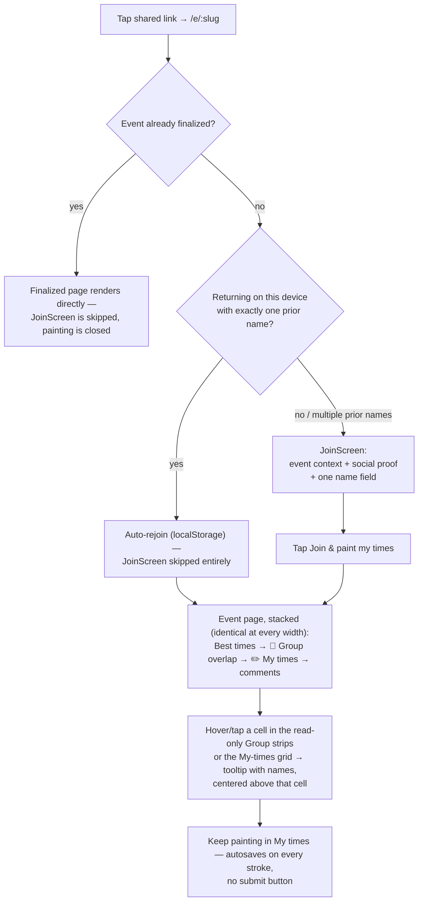
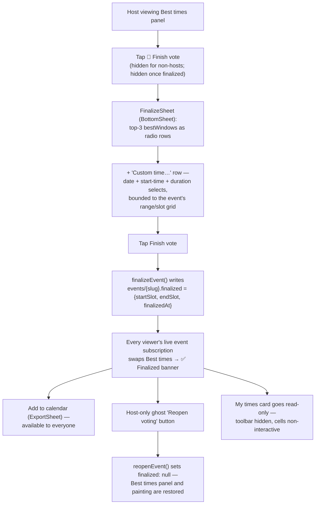

# UX Flows

Host and invitee journeys through schedule2gather after the 2026-07 redesign
(`docs/superpowers/specs/2026-07-18-redesign-design.md` §3) and the v1.1 follow-up
(`docs/superpowers/specs/2026-07-18-v1.1-followup-design.md`). Painting mechanics (drag paintbrush,
paint-mode/scroll gating, undo/redo, autosave, haptics, keyboard nav, ARIA) are retained unchanged
from earlier phases and reskinned onto the new tokens — not rebuilt.

## Host journey

The create form asks only two decisions up front — **event name** and **dates** (multi-select
calendar, 1 month on mobile / 2 on desktop, past dates disabled, per-month "All / Weekdays /
Weekends" quick-select). Everything else collapses into one summary row
(`⚙ 9 AM – 9 PM · 30 min · Eastern ▾`) that expands into the earliest/latest hour selects, a
15/30/60-minute `SegmentedControl`, and a time zone override — all defaulted so a host can ignore
them entirely. One tap on **Create event** calls the existing `createEvent` Cloud Function and
lands the host on `/e/:slug`, already joined (no separate join step for the creator). No sign-in is
required to create or paint; Google sign-in remains available to hosts who want cross-device
ownership (`SignInButton`, unchanged from earlier phases).

**Date picking has two modes** (v1.1 follow-up), switched via a `Pick days | Date range`
`SegmentedControl` above the calendar (default: **Pick days**). Range mode swaps the calendar to
`DayPicker mode="range"`: tapping a start day then an end day merges every day in that span (past
days excluded) into the same `selectedDates` set day-picking uses, via the pure
`mergeRangeIntoDates` helper (`src/lib/dateRange.ts`), then resets the range draft so another span
can be added. Switching modes never discards existing selections; "Clear all" clears both the
selection and any in-progress range draft. The per-month "All / Weekdays / Weekends" quick-select
buttons and the "N selected" count work identically in both modes. On mobile (`<768px`), the
calendar's day cells get comfortable touch targets — **42×42px minimum**, 15px font, a 4px
inter-cell gap — via a `max-width: 767px` rule in `src/index.css`; desktop keeps the tighter
default spacing.

**Selected-dates preview** (v1.2): once at least one date is picked, a chips row appears between
the calendar and the "N selected" line — one removable chip per date (`Mon, Jul 27` + a `×`
button), sorted ascending, working identically in both pick modes (removing a chip only ever edits
`selectedDates`, never `rangeDraft`). On desktop the row wraps (`flex-wrap`); on phones it's a
single horizontally-scrollable line (`overflow-x-auto flex-nowrap`) so a long run of dates stays
thumb-swipeable instead of pushing the page taller.

**Advanced settings time range** (v1.2, mobile only): when `useIsMobile()`, the Earliest/Latest
fields in the Advanced settings panel render as a pair of side-by-side `WheelPicker` scroll wheels
instead of native `<select>` dropdowns — desktop is unchanged and keeps the selects. Validity is
enforced by construction, not rejection: the pure `clampTimeRange()` helper
(`src/lib/timeRange.ts`) guarantees `start < end` by pushing the *sibling* bound out of the way
whenever a wheel change would violate it (e.g. dragging Earliest past the current Latest bumps
Latest forward by an hour) rather than blocking the scroll or showing an error. When a change
triggers that auto-push, a hint line appears under the wheels for ~2.5 seconds: "Adjusted — the
window must be at least 1 hour." `handleSubmit` still carries a defense-in-depth check
(`startHour >= endHour` → "Latest must be after earliest") in case construction is ever bypassed,
and the server validation in `createEvent` remains the final word.

## Invitee journey

`JoinScreen` (`src/components/JoinScreen.tsx`) shows "You're invited to" + event title, date/slot
count, an avatar row of up to 5 existing participants with a "+N" overflow, a live "N people have
painted their times" count, one name `TextField`, and a **Join & paint my times** button — plus the
hint "No account needed. Come back with the same name to edit." If this device already has exactly
one stored name for the event, `EventPage` auto-joins and the screen is skipped entirely; with
multiple stored names it shows them as one-tap "on this device" shortcuts instead of forcing retype.

Once joined, the event page is a single stacked column — **no Me/Group toggle, no side-by-side
dual grid** (both removed in the v1.1 follow-up). The order is fixed and identical at every
viewport: header → `ShareLinkBanner` → Best times panel (or the Finalized banner, see below) →
**👥 Group overlap** (`GroupHeatmap` — read-only, one horizontal strip per event date, darker green
= more people free) → **✏️ My times** (`AvailabilityGrid` — the paint toolbar and grid, mine-only
now) → comments. Hovering (desktop) or tapping (touch) a cell shows a who's-free tooltip centered
directly above that cell in **both** places: the Group strips (24-hour slot time + names + count,
e.g. "19:00 · Jacob, Sam · 2/3") and the viewer's own My-times cells (just the names of everyone
free in that slot, via the existing `CellTooltip`). There is no explicit save step anywhere in
either flow: every committed stroke calls
`updateMyAvailability`, which writes straight to Firestore.

**Grid view options** (v1.2, `AvailabilityGrid` toolbar): a **− / +** zoom control cycles the grid
through three persisted cell sizes — `sm` (`w-8 h-5`), `md` (`w-12 h-6`, the pre-v1.2 default),
`lg` (`w-16 h-10`) — with the row-header/time-label text stepping between `text-[10px]` /
`text-xs` / `text-sm` to match. The buttons disable at each end of the scale. The chosen zoom
persists to `localStorage['s2g-grid-zoom']` (best-effort, wrapped in try/catch for private
browsing; an unrecognized stored value falls back to `md`) and is available at every viewport, not
just mobile. On mobile only, a **"Event days only"** toggle (`aria-pressed`, default **on**) sits
alongside it: when on, the paginated week/month grid filters out columns for dates outside the
event (`eventDateIdx === -1`) and drops any week/month page that would contain zero event dates
from the Prev/Next pager entirely, so a sparse event (e.g. three Saturdays) doesn't force
thumb-paging through empty weeks; switching it off restores the full calendar, greyed
out-of-range columns included. If filtering would ever leave zero pages, the toggle is ignored and
the full page set renders instead (defensive — shouldn't happen for a valid event).

## Finish the vote (host)

- The 🏁 **Finish vote** button lives in the Best times card, visible only to the host and only
  before finalization. It opens `FinalizeSheet`, which lists the same top-3 ranked windows as the
  panel (as radio rows) plus a **"Custom time…"** row that expands date/start-time/duration
  selects bounded to the event's configured time range and slot grid — any window is selectable
  even if no suggestions exist yet (nobody has painted).
- Confirming calls `finalizeEvent(slug, { startSlot, endSlot })`, which writes
  `events/{slug}.finalized`. Every other viewer picks this up through the existing live
  `subscribeToEvent` — no polling, no reload, no separate notification.
- **Finalized state, for every viewer:** the Best times panel is replaced by `FinalizedBanner` —
  "✅ Finalized — Wed Jul 22, 7:00–8:30 PM" in the viewer's time zone, a live attendance count, an
  **Add to calendar** button (opens the existing `ExportSheet` for the final window), and — host
  only — a ghost **Reopen voting** button. The My-times card's toolbar disappears and its cells
  stop responding to pointer/keyboard input (`AvailabilityGrid`'s `readOnly` prop), with the
  subline swapped to "Voting closed — the time is locked in." The Group heatmap and comments stay
  live and unaffected.
- The lock is **server-enforced, not just a UI affordance**: `firestore.rules` requires
  `eventOpen()` (no `finalized`, or `finalized == null`) for both `create` and `update` on
  `events/{id}/participants/{pid}`. A paint attempt racing a finalize is rejected at the rules
  layer; the optimistic local paint state self-corrects on the next participants snapshot — no
  error modal.
- **New visitors to a finalized event skip `JoinScreen` entirely** — `EventPage` renders the
  Finalized banner, Group heatmap, and comments directly, since painting is closed and a join
  write would be rejected by rules anyway. Commenting still requires having joined earlier; the
  comment box shows "Voting is closed — only earlier participants can comment" as its placeholder
  for non-participants.
- Finalize/reopen write failures render an inline "Couldn't save — try again" /
  "Couldn't reopen — try again" line inside the sheet/banner rather than crashing.
  `lastVisitedAt` writes (used only for garbage collection, see `docs/architecture.md`) are
  separately fire-and-forget and silent on failure.

## Screen inventory

| Route | Component | Contents |
|---|---|---|
| `/` | `LandingPage` | `Wordmark`, `ThemeToggle`, value-prop heading, `CreateEventForm` (with the Pick days / Date range toggle) |
| `/e/:slug` | `EventPage` | If not finalized and not yet joined: `JoinScreen`. Otherwise: header (`Wordmark`, `ThemeToggle`, event title, date/slot count, participant `Avatar` row with presence dots, host badge + sign-in for the owner, `TimezonePicker`) → `ShareLinkBanner` → `BestTimesPanel` (spawns `ExportSheet` / host-only `FinalizeSheet`) **or** `FinalizedBanner` when finalized → `GroupHeatmap` → My-times `Card` wrapping `AvailabilityGrid` (only when joined; `readOnly` when finalized) → `CommentsPanel` |

## Mobile vs desktop

The stacked section layout is **identical at all widths** — the old `≥1024px` side-by-side dual
grid and its `useMinWidth` hook are gone. The remaining responsive differences:

| Breakpoint | Behavior |
|---|---|
| `<640px` (Tailwind default, no `sm:`) | `BottomSheet` (used by `ExportSheet` and `FinalizeSheet`) renders as a sheet anchored to the bottom of the viewport |
| `≥640px` (Tailwind `sm:`) | `BottomSheet` renders as a centered modal — see `docs/design-system.md` "Documented deviations" for why this is 640px rather than the spec's originally-stated 768px |
| `<768px` (`useIsMobile()` true) | Create-flow calendar shows 1 month at a time, with ≥42px day touch targets and a horizontally-scrollable date-chips row; Advanced settings' Earliest/Latest fields render as `WheelPicker` scroll wheels; the event-page My-times grid switches to paginated week/month view (`SegmentedControl` for Week/Month, Prev/Next paging, `X/Y` page indicator) with an added "Event days only" toggle (default on) |
| `≥768px` | Create-flow calendar shows 2 months side by side with native `<select>` Earliest/Latest dropdowns; the event-page My-times grid shows every event date in one unpaginated table (no "Event days only" toggle — nothing to filter) |
| all widths | The grid's − / + zoom control (3 persisted cell sizes, `localStorage['s2g-grid-zoom']`) is available regardless of breakpoint |

## Accessibility

- **ARIA grid semantics:** `AvailabilityGrid` is now the only ARIA grid in the page — a single
  `<table role="grid">` with `aria-rowcount`/`aria-colcount`, `role="row"`/`"columnheader"`/
  `"rowheader"`/`"gridcell"` on the appropriate elements, `aria-selected` per cell reflecting the
  participant's own painted state, and a descriptive `aria-label` per cell (date + time +
  availability state). When `readOnly` (finalized), the table keeps its labels but drops
  interactivity (`tabIndex`, pointer/keyboard handlers). `GroupHeatmap` is **not** an ARIA grid —
  each date's strip is a row of plain `<button>` cells with a descriptive `aria-label` (time +
  names + count-of-total) for screen readers; there's no `role="grid"`/row/column-header structure
  since it's read-only and has no per-cell selection concept.
- **Keyboard map:** Arrow keys move focus one slot at a time within the My-times grid (roving
  `tabIndex`, clamped at the grid edges and, on mobile, auto-paging when focus crosses into an
  adjacent week/month page); `Space` or `Enter` toggles the focused slot; `Ctrl+Z` (⌘Z on Mac) undoes
  the last committed stroke and `Ctrl+Shift+Z` (⌘⇧Z) redoes it, both also exposed as buttons with
  matching `title`/`aria-label` hints. Hotkeys are suppressed while focus is inside an `<input>`,
  `<textarea>`, or any `contenteditable` element. `GroupHeatmap` cells are plain tab-focusable
  buttons (hover/tap/Enter opens the tooltip) without roving-tabIndex or arrow-key traversal.
- **Theme:** `system` preference follows `prefers-color-scheme` live (a `matchMedia` change
  listener re-applies the theme without a page reload); an explicit light/dark choice overrides it
  until cleared.
- **Contrast:** every ink-on-surface pairing in both themes targets WCAG AA (4.5:1) per the design
  spec — see `docs/design-system.md` for the full token tables.
