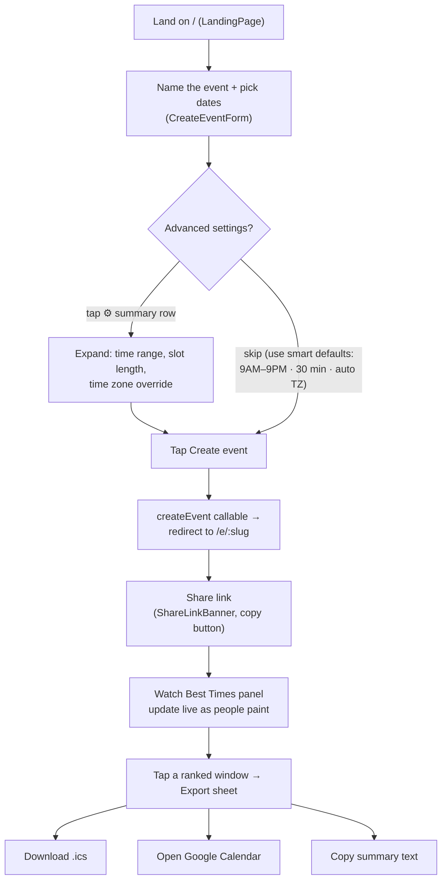
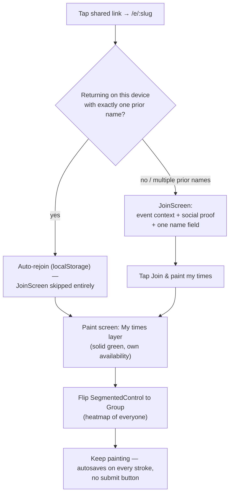

# UX Flows

Host and invitee journeys through schedule2gather after the 2026-07 redesign
(`docs/superpowers/specs/2026-07-18-redesign-design.md` §3). Painting mechanics (drag paintbrush,
paint-mode/scroll gating, undo/redo, autosave, haptics, keyboard nav, ARIA) are retained unchanged
from earlier phases and reskinned onto the new tokens — not rebuilt.

## Host journey

The create form asks only two decisions up front — **event name** and **dates** (multi-select
calendar, 1 month on mobile / 2 on desktop, past dates disabled, per-month "All / Weekdays /
Weekends" quick-select). Everything else collapses into one summary row
(`⚙ 9 AM – 9 PM · 30 min · Eastern ▾`) that expands into the earliest/latest hour selects, a
15/30/60-minute `SegmentedControl`, and a time zone override — all defaulted so a host can ignore
them entirely. One tap on **Create event** calls the existing `createEvent` Cloud Function and
lands the host on `/e/:slug`, already joined (no separate join step for the creator). No sign-in is
required to create or paint; Google sign-in remains available to hosts who want cross-device
ownership (`SignInButton`, unchanged from earlier phases).

## Invitee journey

`JoinScreen` (`src/components/JoinScreen.tsx`) shows "You're invited to" + event title, date/slot
count, an avatar row of up to 5 existing participants with a "+N" overflow, a live "N people have
painted their times" count, one name `TextField`, and a **Join & paint my times** button — plus the
hint "No account needed. Come back with the same name to edit." If this device already has exactly
one stored name for the event, `EventPage` auto-joins and the screen is skipped entirely; with
multiple stored names it shows them as one-tap "on this device" shortcuts instead of forcing retype.
Once joined, the `SegmentedControl` on `AvailabilityGrid` governs which layer is visible on mobile —
**✏️ My times** (own binary availability, solid paint) or **👥 Group** (heatmap) — with the hint
"Drag to paint · saves automatically." There is no explicit save step anywhere in either flow:
every committed stroke calls `updateMyAvailability`, which writes straight to Firestore.

## Screen inventory

| Route | Component | Contents |
|---|---|---|
| `/` | `LandingPage` | `Wordmark`, `ThemeToggle`, value-prop heading, `CreateEventForm` |
| `/e/:slug` | `EventPage` | If not yet joined: `JoinScreen`. Otherwise: header (`Wordmark`, `ThemeToggle`, event title, date/slot count, participant `Avatar` row with presence dots, host badge + sign-in for the owner, `TimezonePicker`) → `ShareLinkBanner` → `BestTimesPanel` (spawns `ExportSheet` on demand) → `AvailabilityGrid` → `CommentsPanel` |

## Mobile vs desktop

| Breakpoint | Behavior |
|---|---|
| `<1024px` (`useMinWidth(1024)` false) | `AvailabilityGrid` shows one grid at a time, switched via the **✏️ My times / 👥 Group** `SegmentedControl` |
| `≥1024px` | Both grids render side by side (`dualGrid`) — My-times on the left, Group heatmap on the right — the when2meet-familiar dual layout; the layer toggle disappears |
| `<640px` (Tailwind default, no `sm:`) | `BottomSheet` (used by `ExportSheet`) renders as a sheet anchored to the bottom of the viewport |
| `≥640px` (Tailwind `sm:`) | `BottomSheet` renders as a centered modal — see `docs/design-system.md` "Documented deviations" for why this is 640px rather than the spec's originally-stated 768px |
| `<768px` (`useIsMobile()` true) | Create-flow calendar shows 1 month at a time; the event-page grid switches to paginated week/month view (`SegmentedControl` for Week/Month, Prev/Next paging, `X/Y` page indicator) |
| `≥768px` | Create-flow calendar shows 2 months side by side; the event-page grid shows every event date in one unpaginated table |

## Accessibility

- **ARIA grid semantics:** each rendered table uses `role="grid"` with `aria-rowcount`/
  `aria-colcount`, `role="row"`/`"columnheader"`/`"rowheader"`/`"gridcell"` on the appropriate
  elements, and a descriptive `aria-label` per cell (date + time + availability state, or
  count-of-total for the Group layer). The My-times grid additionally sets `aria-selected` on each
  cell to reflect the participant's own painted state; the read-only Group grid does not (it has no
  per-cell selection concept).
- **Keyboard map:** Arrow keys move focus one slot at a time within the interactive grid (roving
  `tabIndex`, clamped at the grid edges and, on mobile, auto-paging when focus crosses into an
  adjacent week/month page); `Space` or `Enter` toggles the focused slot; `Ctrl+Z` (⌘Z on Mac) undoes
  the last committed stroke and `Ctrl+Shift+Z` (⌘⇧Z) redoes it, both also exposed as buttons with
  matching `title`/`aria-label` hints. Hotkeys are suppressed while focus is inside an `<input>`,
  `<textarea>`, or any `contenteditable` element.
- **Theme:** `system` preference follows `prefers-color-scheme` live (a `matchMedia` change
  listener re-applies the theme without a page reload); an explicit light/dark choice overrides it
  until cleared.
- **Contrast:** every ink-on-surface pairing in both themes targets WCAG AA (4.5:1) per the design
  spec — see `docs/design-system.md` for the full token tables.
