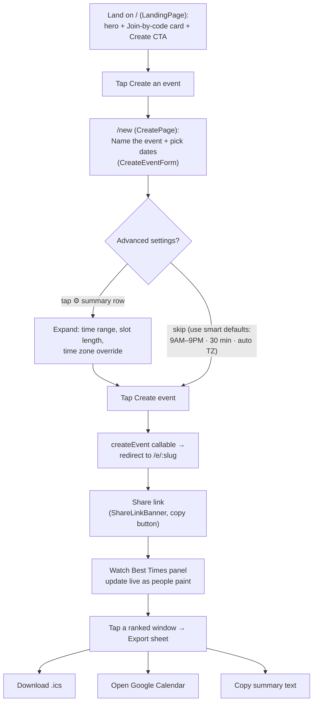
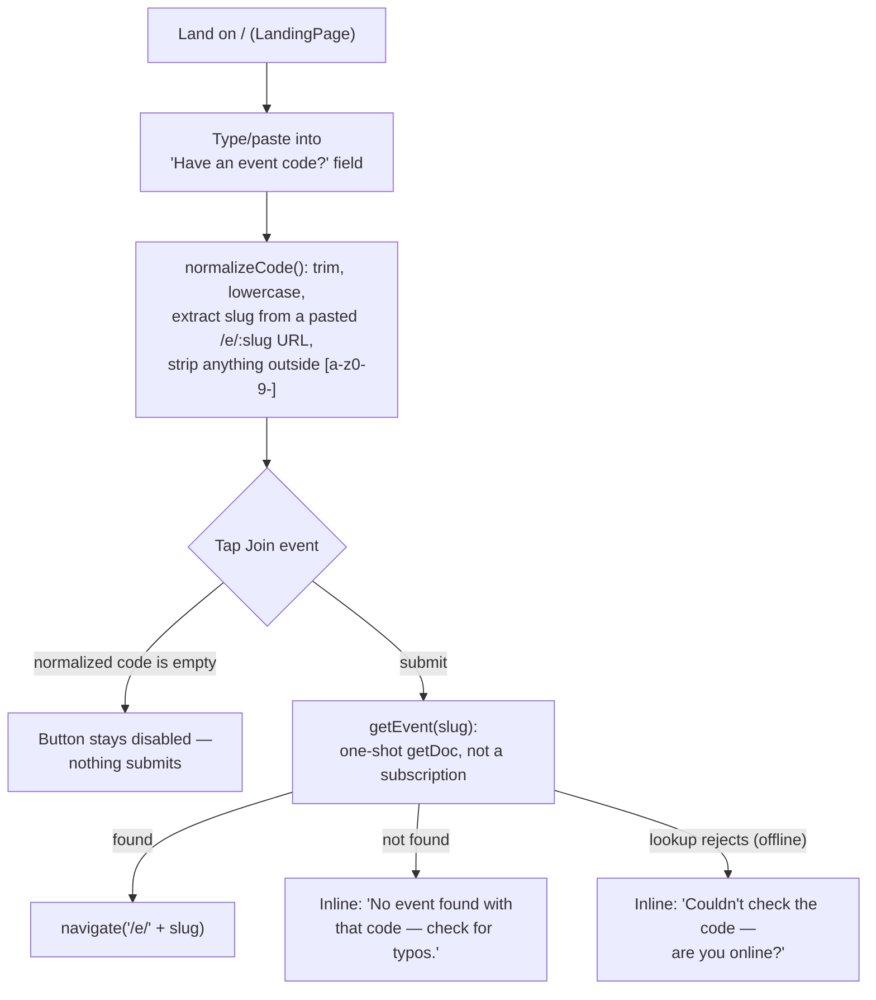
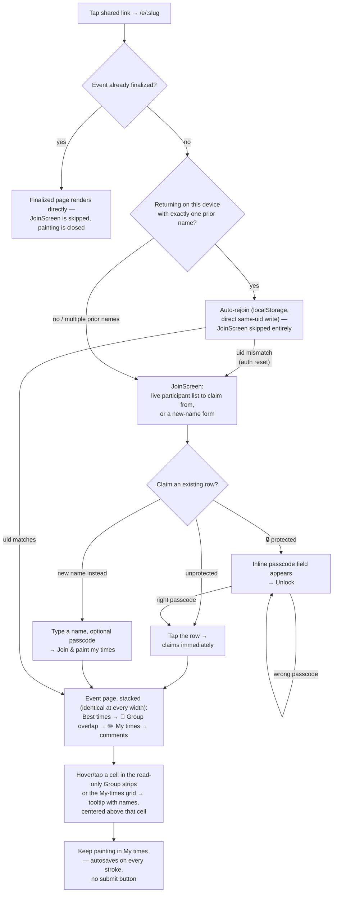
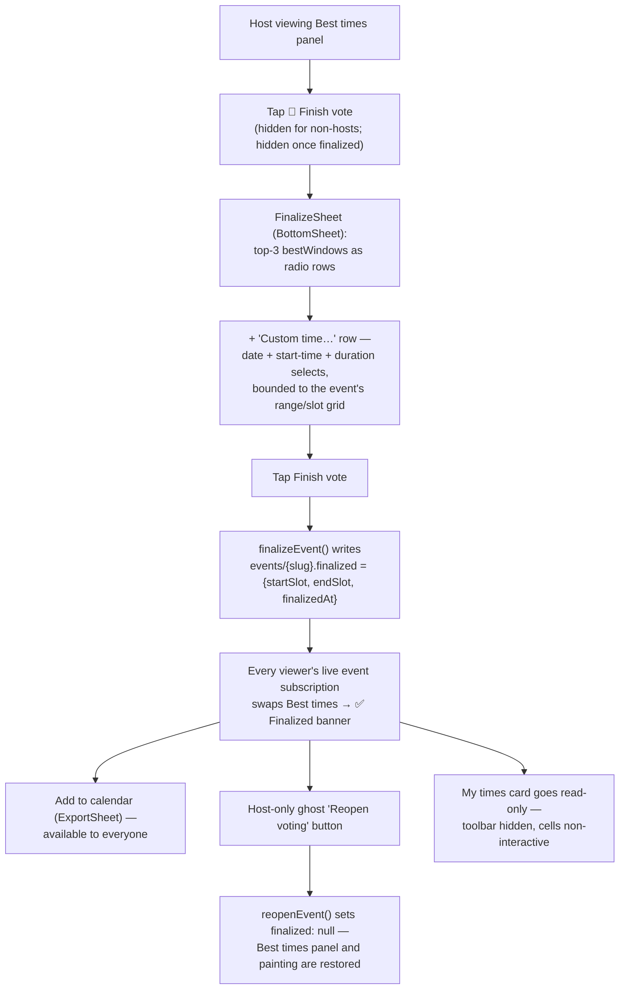
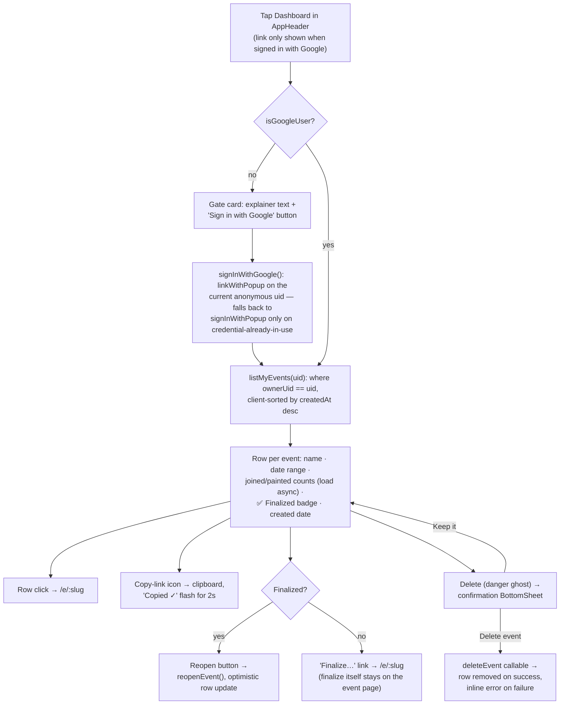

# UX Flows

Host and invitee journeys through schedule2gather after the 2026-07 redesign
(`docs/superpowers/specs/2026-07-18-redesign-design.md` §3), the v1.1 follow-up
(`docs/superpowers/specs/2026-07-18-v1.1-followup-design.md`), the v1.2 mobile UX pass
(`docs/superpowers/specs/2026-07-19-v1.2-mobile-ux-design.md`), the v1.3 landing/dashboard redesign
(`docs/superpowers/specs/2026-07-19-v1.3-landing-dashboard-design.md`) — new landing hero +
join-by-code, a dedicated `/new` create route, an owner `/dashboard`, and the `deleteEvent`
callable — and the v1.4 auth/join polish
(`docs/superpowers/specs/2026-07-19-v1.4-auth-join-polish-design.md`) — instant sign-in/sign-out
state, 1h-inactivity auto-logoff, a claim-or-create join flow with optional passcodes, a tinted
header band, and create-form/grid layout rework. Painting mechanics (drag paintbrush,
paint-mode/scroll gating, undo/redo, autosave, haptics, keyboard nav, ARIA) are retained unchanged
from earlier phases and reskinned onto the new tokens — not rebuilt.

Every page (`LandingPage`, `CreatePage`, `DashboardPage`, `EventPage`) shares one `AppHeader`
(`src/components/AppHeader.tsx`, v1.3; v1.4 session cluster below), rendered as a full-width tinted
band — `bg-primary/10 border-b border-line` wrapping the max-width row — replacing the ad-hoc
per-page headers from earlier phases. Inside: a `Wordmark`, then either a signed-in cluster (a
**Dashboard** link plus a **Sign out** ghost button calling `authStore.signOut()`) or a **Sign in**
ghost button (calls `authStore.signInWithGoogle`), and the `ThemeToggle`. The signed-in/signed-out
branch now reads the `isGoogleUser` store flag (v1.4) rather than `user.isAnonymous` directly, so
the header flips **instantly** on Google sign-in — see `docs/architecture.md` "Auth session model"
for why that distinction matters (`linkWithPopup` mutates the existing Firebase `User` in place, so
`onAuthStateChanged` alone doesn't reliably trigger a re-render). It accepts a `className` width
override — `max-w-2xl` on landing/create, `max-w-5xl` (the default) on dashboard/event.

**Session lifecycle (v1.4):** signing in with Google links the current anonymous uid
(`linkWithPopup`); signing out ends only the Google session — the browser silently re-signs in
anonymously afterward, so voting identity on this device is unaffected. A host or dashboard user
left idle for **1 hour** (no `pointerdown`/`keydown` activity, tracked cross-tab via a shared
`localStorage` clock — see `useAutoLogoff` in `docs/architecture.md`) is automatically signed out;
anonymous participants are never auto-signed-out, since there's no Google session to expire.

## Host journey

The create form (`CreateEventForm`, moved verbatim from the landing page to its own route at `/new`
in v1.3 — `CreatePage` is a thin wrapper of `AppHeader` + heading + the component, no behavior
changed) asks only two decisions up front — **event name** and **dates** (multi-select calendar, 1
month on mobile / 2 on desktop, past dates disabled, per-month "All / Weekdays / Weekends"
quick-select). Everything else collapses into one summary row (`⚙ 9 AM – 9 PM · 30 min · Eastern
▾`) that expands into the earliest/latest hour selects, a 15/30/60-minute `SegmentedControl`, and a
time zone override — all defaulted so a host can ignore them entirely. One tap on **Create event**
calls the existing `createEvent` Cloud Function and lands the host on `/e/:slug`, already joined (no
separate join step for the creator). No sign-in is required to create or paint; Google sign-in
remains available to hosts who want cross-device ownership (`SignInButton` on the event page,
unchanged from earlier phases) and now also unlocks the **Host dashboard** (below) for finding
previously-created events.

**Date picking has two modes** (v1.1 follow-up), switched via a `Pick days | Date range`
`SegmentedControl` above the calendar (default: **Pick days**). Range mode swaps the calendar to
`DayPicker mode="range"`: tapping a start day then an end day merges every day in that span (past
days excluded) into the same `selectedDates` set day-picking uses, via the pure
`mergeRangeIntoDates` helper (`src/lib/dateRange.ts`), then resets the range draft so another span
can be added. Switching modes never discards existing selections; "Clear all" clears both the
selection and any in-progress range draft. The per-month "All / Weekdays / Weekends" quick-select
buttons and the "N selected" count work identically in both modes. On mobile (`<768px`), the
calendar's day cells get comfortable touch targets — **42×42px minimum**, 15px font, a 4px
inter-cell gap — via a `max-width: 767px` rule in `src/index.css`; desktop keeps the tighter
default spacing.

**Selected-dates list** (v1.4, replacing the v1.2 chips row): the quick-select row itself now ends
in a right-aligned `{n} selected · Clear all` cluster (`Clear all` clears both `selectedDates` and
any in-progress range draft) — there is no separate count/clear line below the calendar anymore.
Directly under that row, once at least one date is picked, a scrollable list appears **above the
calendar**: one row per selected date, sorted ascending — `Mon, Jul 27` left-aligned, a right-aligned
`×` remove button — `text-sm` rows separated by hairlines inside a `max-h-40 overflow-y-auto`
container (roughly 6 rows visible before it scrolls), hidden entirely when nothing is selected. It
works identically in both pick modes (removing a row only ever edits `selectedDates`, never
`rangeDraft`). The range-mode hint paragraph ("Tap a start date, then an end date…") still renders
under the calendar, unchanged.

**Advanced settings time range** (v1.2, mobile only): when `useIsMobile()`, the Earliest/Latest
fields in the Advanced settings panel render as a pair of side-by-side `WheelPicker` scroll wheels
instead of native `<select>` dropdowns — desktop is unchanged and keeps the selects. Validity is
enforced by construction, not rejection: the pure `clampTimeRange()` helper
(`src/lib/timeRange.ts`) guarantees `start < end` by pushing the *sibling* bound out of the way
whenever a wheel change would violate it (e.g. dragging Earliest past the current Latest bumps
Latest forward by an hour) rather than blocking the scroll or showing an error. When a change
triggers that auto-push, a hint line appears under the wheels for ~2.5 seconds: "Adjusted — the
window must be at least 1 hour." `handleSubmit` still carries a defense-in-depth check
(`startHour >= endHour` → "Latest must be after earliest") in case construction is ever bypassed,
and the server validation in `createEvent` remains the final word.

## Join by code

`LandingPage` (`src/pages/LandingPage.tsx`, v1.3) pairs the join card with the Create CTA below the
hero: a `TextField` labeled "Have an event code?" plus a "Join event" `Button`. `normalizeCode()`
(`src/lib/joinCode.ts`) accepts either a bare code or a pasted full share link — it trims,
lowercases, and if the input matches `/\/e\/([a-z0-9-]+)/` extracts just the slug, then strips any
character outside `[a-z0-9-]`. Submitting calls `getEvent(slug)`
(`src/services/eventService.ts` — a one-shot `getDoc`, unlike the live `subscribeToEvent` used once
on the event page itself): a hit navigates straight to `/e/{slug}`; a miss shows an inline "No event
found with that code — check for typos."; a rejected lookup (e.g. offline) shows "Couldn't check the
code — are you online?". The Join button is disabled whenever the normalized code is empty, so an
all-whitespace or punctuation-only paste can't be submitted.

## Invitee journey

**Join flow (v1.4 rework, `src/components/JoinScreen.tsx`):** shows "You're invited to" + event
title and date/slot count, then two sections. First, if any participants already exist, a "Continue
as" card lists every one of them as a row — `Avatar` + name, and a 🔒 badge when `participant.
protected` is true. Tapping an unprotected row claims it immediately
(`join({ claimParticipantId })`); tapping a protected row expands an inline passcode `TextField` +
**Unlock** button in place, submitting `join({ claimParticipantId, passcode })`. Second, a "— or
join as a new name —" card (labeled "Join in" when no participants exist yet): a name field plus an
*optional* passcode field with the hint "A passcode lets you reclaim this name from another device
— and stops others from taking it," submitting `join({ name, passcode })`. Every action shares one
inline error line below both cards, mapped from the callable's typed error codes: a taken name
says "That name is taken — tap it above to claim it" (points back at the claim flow rather than
retyping); a wrong passcode says "Wrong passcode — try again"; a closed event says "Voting is
closed for this event." The v1.1-era "prior names on this device" one-tap shortcuts are gone —
the live participant list supersedes them, since it now shows *everyone's* names, not just this
device's history.

Auto-rejoin is otherwise unchanged: if this device has exactly one stored name for the event,
`EventPage` calls `rejoinStored` (a direct same-uid Firestore write, not the callable) and skips
`JoinScreen` entirely. The one new edge case (v1.4): if that direct write is rejected — e.g. the
browser's anonymous auth session was reset, so the caller's uid no longer matches the uid already
on the stored participant doc — the promise rejects, `EventPage` falls through to showing
`JoinScreen`, and the user claims their name from the live list (passcode required if they'd
protected it).

Once joined, the event page is a single stacked column — **no Me/Group toggle, no side-by-side
dual grid** (both removed in the v1.1 follow-up). The order is fixed and identical at every
viewport: header → `ShareLinkBanner` → Best times panel (or the Finalized banner, see below) →
**👥 Group overlap** (`GroupHeatmap` — read-only, one horizontal strip per event date, darker green
= more people free) → **✏️ My times** (`AvailabilityGrid` — the paint toolbar and grid, mine-only
now) → comments. Hovering (desktop) or tapping (touch) a cell shows a who's-free tooltip centered
directly above that cell in **both** places: the Group strips (24-hour slot time + names + count,
e.g. "19:00 · Jacob, Sam · 2/3") and the viewer's own My-times cells (just the names of everyone
free in that slot, via the existing `CellTooltip`). There is no explicit save step anywhere in
either flow: every committed stroke calls
`updateMyAvailability`, which writes straight to Firestore.

**Grid controls layout (v1.4 rework, `AvailabilityGrid`):** three rows now bracket the table instead
of one toolbar above it. **Above the table** (interactive grids only): the `Week`/`Month`
`SegmentedControl` (mobile) plus `Mark all available` / `Clear all` pill buttons on the left, and a
visually separate `ml-auto` cluster on the right holding **Undo**/**Redo** as icon-only circular
buttons (`↺`/`↻`, `w-9 h-9 rounded-full border border-line bg-surface`, disabled/`opacity-40` at
each end of the history stack) — their `title`/`aria-label` still carry the `Ctrl+Z`/`Ctrl+Shift+Z`
(`⌘Z`/`⌘⇧Z` on Mac) hotkey hint, unchanged from v1.1. **Below the table**, rendered after the table
wrapper and before the mobile pagination row (and, unlike the toolbar above, still shown on
`readOnly`/finalized grids — the view controls, not the paint controls): the **− / +** zoom control
and, on mobile, the **"Event days only"** toggle described below.

**Header chip affordance (v1.4):** on interactive grids, every day-column header and time-row
header renders its label inside a chip — `bg-raised border border-line rounded-[8px] px-1.5 py-0.5
active:bg-primary/20 select-none` — signaling that the header itself is tappable (click toggles the
whole column/row, unchanged behavior from earlier phases). `readOnly` grids keep plain, unchipped
text since there's nothing to tap.

**Zoom & filter row:** a **− / +** zoom control cycles the grid through three persisted cell sizes
— `sm` (`w-8 h-5`), `md` (`w-12 h-6`, the pre-v1.2 default), `lg` (`w-16 h-10`) — with the
row-header/time-label text stepping between `text-[10px]` / `text-xs` / `text-sm` to match. The
buttons disable at each end of the scale. The chosen zoom persists to
`localStorage['s2g-grid-zoom']` (best-effort, wrapped in try/catch for private browsing; an
unrecognized stored value falls back to `md`) and is available at every viewport, not just mobile.
On mobile only, a **"Event days only"** toggle (`aria-pressed`, default **on**) sits alongside it:
when on, the paginated week/month grid filters out columns for dates outside the event
(`eventDateIdx === -1`) and drops any week/month page that would contain zero event dates from the
Prev/Next pager entirely, so a sparse event (e.g. three Saturdays) doesn't force thumb-paging
through empty weeks; switching it off restores the full calendar, greyed out-of-range columns
included. If filtering would ever leave zero pages, the toggle is ignored and the full page set
renders instead (defensive — shouldn't happen for a valid event).

## Finish the vote (host)

- The 🏁 **Finish vote** button lives in the Best times card, visible only to the host and only
  before finalization. It opens `FinalizeSheet`, which lists the same top-3 ranked windows as the
  panel (as radio rows) plus a **"Custom time…"** row that expands date/start-time/duration
  selects bounded to the event's configured time range and slot grid — any window is selectable
  even if no suggestions exist yet (nobody has painted).
- Confirming calls `finalizeEvent(slug, { startSlot, endSlot })`, which writes
  `events/{slug}.finalized`. Every other viewer picks this up through the existing live
  `subscribeToEvent` — no polling, no reload, no separate notification.
- **Finalized state, for every viewer:** the Best times panel is replaced by `FinalizedBanner` —
  "✅ Finalized — Wed Jul 22, 7:00–8:30 PM" in the viewer's time zone, a live attendance count, an
  **Add to calendar** button (opens the existing `ExportSheet` for the final window), and — host
  only — a ghost **Reopen voting** button. The My-times card's toolbar disappears and its cells
  stop responding to pointer/keyboard input (`AvailabilityGrid`'s `readOnly` prop), with the
  subline swapped to "Voting closed — the time is locked in." The Group heatmap and comments stay
  live and unaffected.
- The lock is **server-enforced, not just a UI affordance**: `firestore.rules` requires
  `eventOpen()` (no `finalized`, or `finalized == null`) for both `create` and `update` on
  `events/{id}/participants/{pid}`. A paint attempt racing a finalize is rejected at the rules
  layer; the optimistic local paint state self-corrects on the next participants snapshot — no
  error modal.
- **New visitors to a finalized event skip `JoinScreen` entirely** — `EventPage` renders the
  Finalized banner, Group heatmap, and comments directly, since painting is closed and a join
  write would be rejected by rules anyway. Commenting still requires having joined earlier; the
  comment box shows "Voting is closed — only earlier participants can comment" as its placeholder
  for non-participants.
- Finalize/reopen write failures render an inline "Couldn't save — try again" /
  "Couldn't reopen — try again" line inside the sheet/banner rather than crashing.
  `lastVisitedAt` writes (used only for garbage collection, see `docs/architecture.md`) are
  separately fire-and-forget and silent on failure.

## Host dashboard

Because `signInWithGoogle` **links** the existing anonymous uid (`linkWithPopup`, falling back to
`signInWithPopup` only on `auth/credential-already-in-use` / `auth/email-already-in-use`), any event
a host created anonymously *before* signing in keeps the same `ownerUid` and shows up on the
dashboard immediately after sign-in — no separate claim/transfer step, no data migration.

`DashboardPage` (`src/pages/DashboardPage.tsx`, v1.3) gates on the `isGoogleUser` store flag (v1.4;
previously `user && !user.isAnonymous` directly). Signed out (or still anonymous), it shows an
explainer card ("See and manage every event you've created —
sign in and they follow you across devices.") and a "Sign in with Google" button reusing the
existing `authStore.signInWithGoogle`. Once signed in, `listMyEvents(uid)` — a single-field
`where('ownerUid', '==', uid)` query, sorted client-side by `createdAt` descending (see "Dashboard
reads" in `docs/architecture.md` for why no composite index is needed) — loads the list: loading
renders three pulsing skeleton rows, an empty list shows "Nothing yet — create your first event"
with a CTA to `/new`, and a query failure shows a Retry button. Each row's joined/painted counts
load **after** the list (`countParticipants(slug)`, one call per event, aggregate `getCountFromServer`
queries — no participant documents are downloaded); if the "painted" aggregate query rejects (its
`availability != ''` filter can need an index), only that figure is hidden for that row, not the
whole row.

Row actions: clicking anywhere on the row card navigates to `/e/{slug}`; a "Copy link" button copies
the share URL to the clipboard and flashes "Copied ✓" for 2s (falls back to an inline error banner
if `navigator.clipboard.writeText` throws); a finalized event shows a **Reopen** button (calls the
existing `reopenEvent`, then optimistically patches that row's `finalized` to `null` in local state
rather than re-fetching); a non-finalized event shows a **Finalize…** link that deep-links to
`/e/{slug}` instead — finalizing is not done inline on the dashboard, only from the event page's
existing Finish-vote flow. **Delete** opens a `BottomSheet` confirmation ("Delete "&lt;name&gt;"? All
votes and comments are removed permanently. This can't be undone.") with "Keep it" / "Delete event"
buttons; confirming calls the new `deleteEvent` Cloud Function (`deleteEventRemote` in
`src/services/eventService.ts`) and removes the row from the list on success, or shows an inline
"Couldn't delete — try again." on failure without closing the sheet (the delete button also disables
while in flight).

## Screen inventory

| Route | Component | Contents |
|---|---|---|
| `/` | `LandingPage` (v1.3, rewritten) | `AppHeader` (`max-w-2xl`) · hero heading + subline · Create CTA `Button` → `/new` · join-by-code `Card` (`TextField` + `normalizeCode` + one-shot `getEvent` lookup) |
| `/new` | `CreatePage` (v1.3, new) | `AppHeader` (`max-w-2xl`) · heading · the unchanged `CreateEventForm` (Pick days / Date range toggle, Advanced settings) |
| `/dashboard` | `DashboardPage` (v1.3, new) | `AppHeader` (`max-w-5xl`) · signed-out gate (explainer + "Sign in with Google") **or** event list — `listMyEvents`, per-row `countParticipants`, copy-link, inline Reopen, "Finalize…" deep-link, Delete via `deleteEvent` callable behind a confirmation `BottomSheet` |
| `/e/:slug` | `EventPage` | `AppHeader` (`max-w-5xl` default; v1.3 replaces the page's own inline `Wordmark`/`ThemeToggle`). If not finalized and not yet joined: `JoinScreen`. Otherwise: event title, date/slot count, participant `Avatar` row with presence dots, host badge + sign-in for the owner, `TimezonePicker` → `ShareLinkBanner` → `BestTimesPanel` (spawns `ExportSheet` / host-only `FinalizeSheet`) **or** `FinalizedBanner` when finalized → `GroupHeatmap` → My-times `Card` wrapping `AvailabilityGrid` (only when joined; `readOnly` when finalized) → `CommentsPanel` |

Any unmatched route redirects to `/` (`<Route path="*" element={<Navigate to="/" replace />} />` in
`src/App.tsx`).

## Mobile vs desktop

The stacked section layout is **identical at all widths** — the old `≥1024px` side-by-side dual
grid and its `useMinWidth` hook are gone. The remaining responsive differences:

| Breakpoint | Behavior |
|---|---|
| `<640px` (Tailwind default, no `sm:`) | `BottomSheet` (used by `ExportSheet` and `FinalizeSheet`) renders as a sheet anchored to the bottom of the viewport |
| `≥640px` (Tailwind `sm:`) | `BottomSheet` renders as a centered modal — see `docs/design-system.md` "Documented deviations" for why this is 640px rather than the spec's originally-stated 768px |
| `<768px` (`useIsMobile()` true) | Create-flow calendar shows 1 month at a time, with ≥42px day touch targets and the scrollable selected-dates list above the calendar (v1.4); Advanced settings' Earliest/Latest fields render as `WheelPicker` scroll wheels; the event-page My-times grid switches to paginated week/month view (`SegmentedControl` for Week/Month, Prev/Next paging, `X/Y` page indicator) with an added "Event days only" toggle (default on) |
| `≥768px` | Create-flow calendar shows 2 months side by side with native `<select>` Earliest/Latest dropdowns; the event-page My-times grid shows every event date in one unpaginated table (no "Event days only" toggle — nothing to filter) |
| all widths | The grid's − / + zoom control (3 persisted cell sizes, `localStorage['s2g-grid-zoom']`) is available regardless of breakpoint |

## Accessibility

- **ARIA grid semantics:** `AvailabilityGrid` is now the only ARIA grid in the page — a single
  `<table role="grid">` with `aria-rowcount`/`aria-colcount`, `role="row"`/`"columnheader"`/
  `"rowheader"`/`"gridcell"` on the appropriate elements, `aria-selected` per cell reflecting the
  participant's own painted state, and a descriptive `aria-label` per cell (date + time +
  availability state). When `readOnly` (finalized), the table keeps its labels but drops
  interactivity (`tabIndex`, pointer/keyboard handlers). `GroupHeatmap` is **not** an ARIA grid —
  each date's strip is a row of plain `<button>` cells with a descriptive `aria-label` (time +
  names + count-of-total) for screen readers; there's no `role="grid"`/row/column-header structure
  since it's read-only and has no per-cell selection concept.
- **Keyboard map:** Arrow keys move focus one slot at a time within the My-times grid (roving
  `tabIndex`, clamped at the grid edges and, on mobile, auto-paging when focus crosses into an
  adjacent week/month page); `Space` or `Enter` toggles the focused slot; `Ctrl+Z` (⌘Z on Mac) undoes
  the last committed stroke and `Ctrl+Shift+Z` (⌘⇧Z) redoes it, both also exposed as buttons with
  matching `title`/`aria-label` hints. Hotkeys are suppressed while focus is inside an `<input>`,
  `<textarea>`, or any `contenteditable` element. `GroupHeatmap` cells are plain tab-focusable
  buttons (hover/tap/Enter opens the tooltip) without roving-tabIndex or arrow-key traversal.
- **Theme:** `system` preference follows `prefers-color-scheme` live (a `matchMedia` change
  listener re-applies the theme without a page reload); an explicit light/dark choice overrides it
  until cleared.
- **Contrast:** every ink-on-surface pairing in both themes targets WCAG AA (4.5:1) per the design
  spec — see `docs/design-system.md` for the full token tables.
